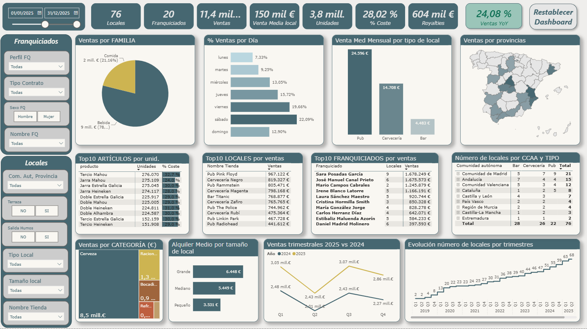

# Proyecto Final
##      Informe 360 Grupo SaDaAm 2025

## 1. Descripción

    Este proyecto forma parte del Máster en Data Analytics de ThePower   
    en el que se aplican los conociemientos adquiridos en Python y PowerBi.  
   
    Representa un cuadro de mando desarrollado en Power BI   
    para analizar la actividad del Grupo SaDaAm durante el año 2025.   
   
    Incluye datos de ventas, artículos, franquiciados, locales,   
    junto con un informe de conclusiones basado en los datos.  
   
   *NOTA: Todos los datos son ficticios y se han generado con scripts de Python*
    

## 2. Objetivos del análisis

    Analizar ventas y costes.

    Identificar productos y categorías clave.

    Evaluar rendimiento global de la compañía llegando al detalle por local y franquiciado.

    Estudiar distribución geográfica y evolución temporal.

    Extraer conclusiones ejecutivas.

## 3. Contenido del repositorio

    /data → ficheros originales (locales, franquiciados, ventas, productos…).
    (Aquí se incluye un CSV de ejemplo con los datos que genera el script del proyecto_final.ipynb)

    /pbix → archivo Power BI.

    /docs → informe de conclusiones.

    /py → scripts para generar las tablas originales y proyecto_final.ipynb

    /img → capturas del dashboard

    README.md → documentación del proyecto.

## 4. Resumen de conclusiones

    ✔ 76 locales activos en 2025. 🏩

    ✔ 19 franquiciados + 7 locales propios del franquiciador. 👨‍💼👩‍💼

    ✔ 11,4M € en ventas 2025. 

    ✔ Coste medio del 28,02%. 

    ✔ La cerveza representa el 78% de las ventas. 🍺

    ✔ Sábado y viernes concentran el 42% del total. 🎉

    ✔ Madrid y Andalucía son las regiones con mayor presencia.
   

## 5. Tecnologías utilizadas

    ✔ Visual Studio

    ✔ Power BI

    ✔ Excel

    ✔ GitHub

    ✔ DAX

## 6. Autor

    Sergio Molinero Canal 🧔
    sergiomolinerocanal@gmail.com ☝
